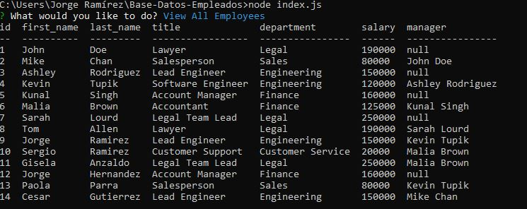

# Base de Datos de Empleados

## Descripción de la aplicación  

* Esta aplicación permite desplegar y gestionar los departamentos, roles y empleados de una empresa, a partir de una base de datos.
* Es una aplicación de línea de comando que acepta la entrada de usuario.
* Por medio de un menú de opciones, da la posibilidad al usuario de:
    * Ver todos los empleados:
        + Despliega una tabla formateada con los datos de los empleados (identificadores, nombres, apellidos, roles, departamentos, salarios y gerentes de los que dependen) extraídos de la base de datos.
    * Agregar un empleado:
        + Permite introducir la información necesaria para crear un nuevo empleado (nombre, apellido, rol y gerente) y guardarlo en la base de datos.
    * Actualizar el rol de un empleado:
        + Permite seleccionar un empleado, asignarle un rol existente y actualizar dicho rol en la base de datos.
    * Ver todos los roles:
        + Despliega una tabla formateada con la información de los roles (identificador, título, departamento y salario) extraída de la base de datos.
    * Agregar un rol:
        + Permite introducir la información necesaria para crear un nuevo rol (título y salario), asignarlo a un departamento existente y crearlo en la base de datos.
    * Ver todos los departamentos
        + Despliega una tabla formateada con los departamentos extraídos de la base de datos.
    * Agregar un departamento
        + Permite agregar un nuevo departamento a la base de datos.
    * Salir de la aplicación
        + Termina la conexión a la base de datos y se sale de la aplicación.

## Esquema de la base de datos

 * El esquema está conformado por tres tablas que pertenecen a la base de datos "employees_db".
 * La creación de la base de datos y las tablas puede hacerse usando el archivo "schema.sql" ubicado en la carpeta "/db".
 * Igualmente, el archivo "seeds.sql" ubicado en la carpeta "/db" permite la creación de algunos registros iniciales en las tablas de la base de datos.

## Instrucciones de instalación  

* Esta aplicación requiere de:
    * Instalación de node JS versión 16.18.0
    * Instalación del paquete npm inquirer 6.5.2
    * Instalación del paquete npm mysql2 2.2.5
    * Instalación del paquete npm console.table 0.10.0
    * Instalación del paquete npm dotenv 16.0.3

## Instrucciones para realizar pruebas 

* Emplea el archivo "schema.sql" ubicado en la carpeta "/db" para crear la base de datos y las tablas necesarias.
* Es necesario crear un archivo ".env" en la carpeta principal/raíz de la aplicación, donde coloques la contraseña necesaria (utilizando la variable "DB_PASS") para acceder a la base de datos.
* La ejecución de la aplicación se tiene que hacer desde la terminal de node.js
* Asegúrate de estar en la ubicación de la carpeta principal/raíz de la aplicación: BASE-DATOS-EMPLEADOS\  
  
* Ejecuta el comando: "node index.js"  
  
* A partir de este punto puedes seleccionar la opción deseada y comenzar a modificar la base de datos de los empleados  
  

## Información de uso de la aplicación 

* Selecciona cualquier opción de la lista desplegada:    
  
* Si seleccionas "Ver todos los empleados", "Ver todos los departamentos" o "Ver todos los roles", se te presentará una tabla formateada con la información extraída de la base de datos. Después se te desplegará el menú de opciones para que continúes con tu proceso.  
  
* Si seleccionas "Agregar un empleado", "Agregar un rol", "Agregar un departamento" o "Actualizar el rol de un empleado", entonces introduce la información que se te solicita y/o selecciona las opciones que correspondan. Cada vez que quieras enviar la información presiona ENTER.    
    
* Para las opciones donde se agrega o actualiza información en la base de datos, verás un mensaje de éxito si tu información fue agregada a la base de datos. Después se te desplegará el menú de opciones para que continúes con tu proceso.  
  
* Si deseas terminar tu proceso de gestión de la base de datos, puedes seleccionar la opción de "Salir" del menú de opciones. Al seleccionarla y presionar ENTER, la conexión a la base de datos y el proceso terminarán.  
   

## Enlace a video de funcionalidad de la aplicación

* [Link a video de aplicación](https://drive.google.com/file/d/1A4smonfzVVYSx3awb8sNtIqQtBiWuXUh/view?usp=share_link)
